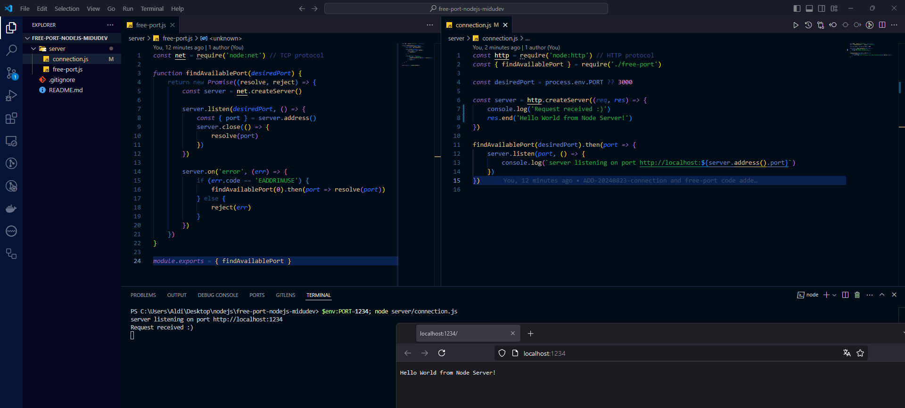

# free-port-nodejs-midudev
Second App created with nodejs during the midudev course

The app receives as an argument a desired port, if it does not find it, it returns the next available one, if a port is not passed, it selects port 3000 by default, if this is not available, it generates the connection with the next available port.

